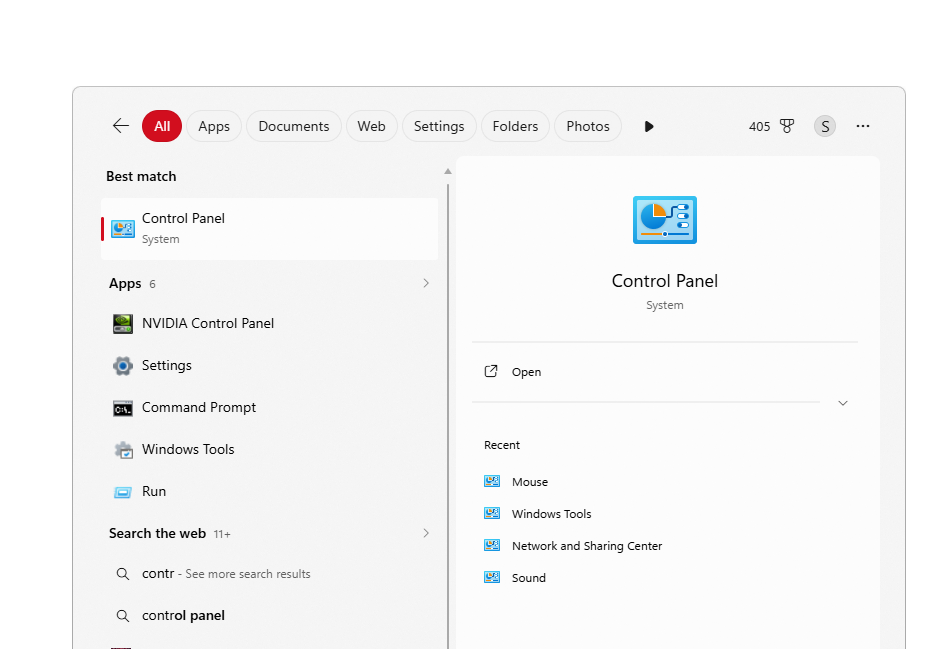
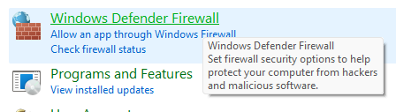
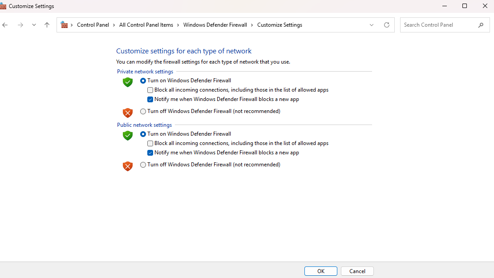
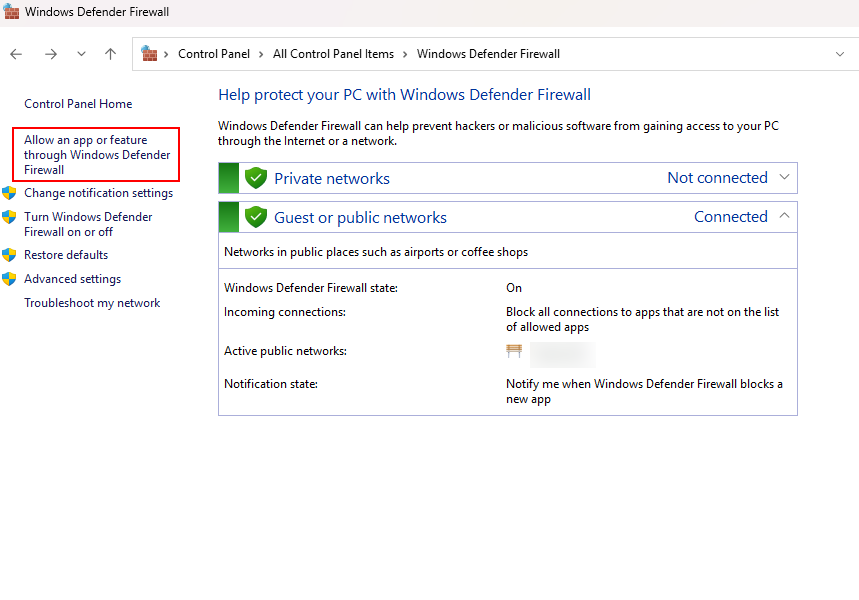
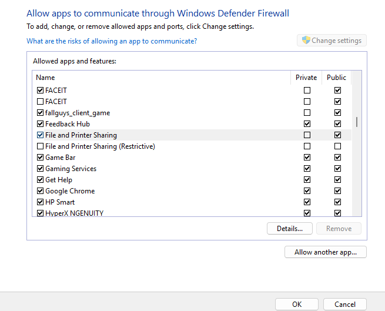
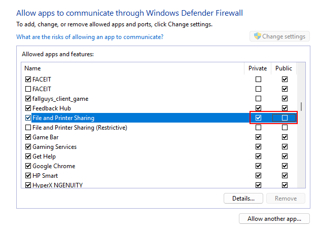
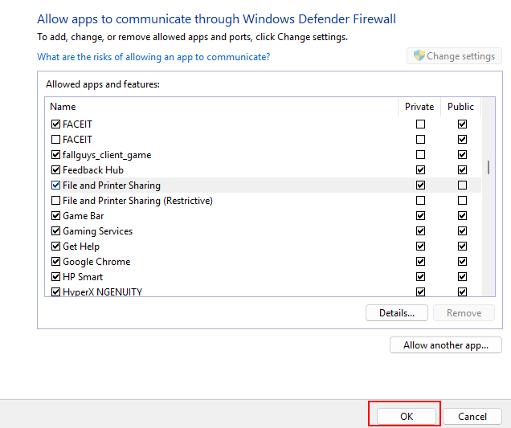

# Lab: Verify Windows Defender Firewall and Allow File and Printer Sharing

This lab walks through checking that Windows Defender Firewall is enabled for private networks, and confirming that **File and Printer Sharing** is allowed only on private (local) networks.

## Prerequisites

- A Windows machine with access to Control Panel
- Permission to view (and, if needed, change) firewall settings

## Steps

### 1. Open Control Panel

Navigate to **Control Panel**.

### 2. Open the firewall status page

Choose **System and Security**, then under **Windows Defender Firewall**, click **Check firewall status**.

### 3. Verify the firewall is on for private networks

Verify that the Windows Defender Firewall state is set to **On** for **Private networks**.

### 4. Open the allowed apps settings

On the left, click **Allow an app or feature through Windows Defender Firewall**.

### 5. Find File and Printer Sharing

Scroll down the list of applications and find **File and Printer Sharing**.

### 6. Confirm the Private box is selected

Confirm that the **Private** box to the right of that option was automatically selected. This allows File and Printer Sharing only for other systems on the same local network. The **Public** box should be unchecked, meaning remote systems on public networks cannot access this feature.

### 7. Apply the setting

Click **OK** to apply the setting.

## Expected Result

- Windows Defender Firewall is **On** for private networks.
- File and Printer Sharing is allowed on **Private** networks only, and not on **Public** networks.
